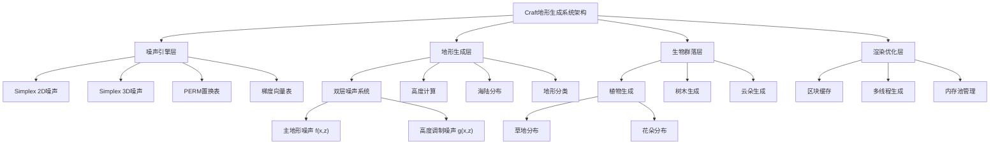
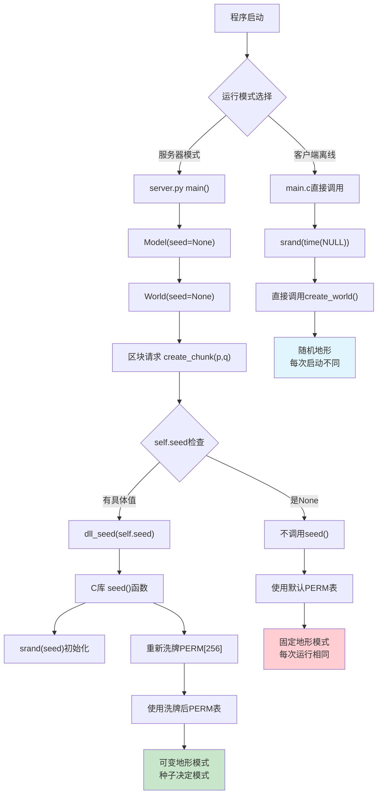
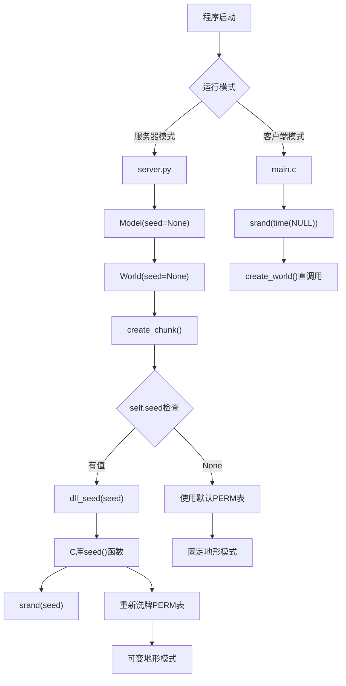
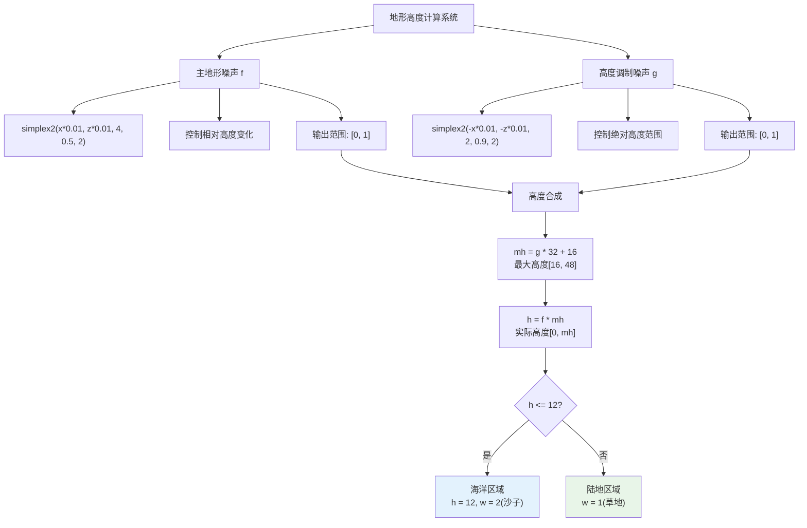
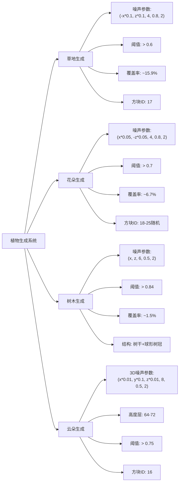
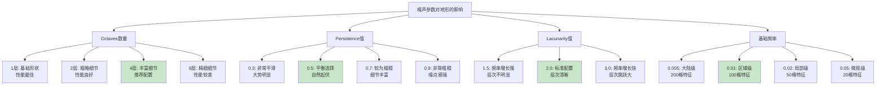
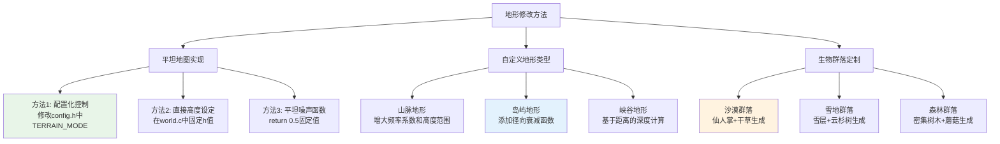
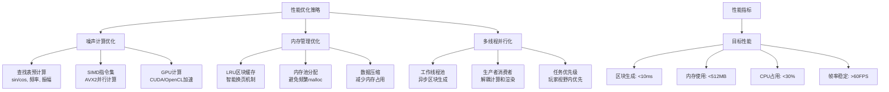

# Craft项目地形生成系统完整分析

> 🎮 **基于Craft开源项目的地形生成系统深度技术解析**  
> 📊 **包含完整的数学模型、算法实现和性能优化策略**  
> 🛠️ **提供实用的参数调优指南和定制化方案**

## 📋 目录
- [1. 系统概述](#1-系统概述)
- [2. 噪声算法核心](#2-噪声算法核心)
- [3. 种子系统机制](#3-种子系统机制)
- [4. 地形生成数学模型](#4-地形生成数学模型)
- [5. 置换表PERM详解](#5-置换表perm详解)
- [6. 生物群落生成算法](#6-生物群落生成算法)
- [7. 自然性实现原理](#7-自然性实现原理)
- [8. 系统参数调优](#8-系统参数调优)
- [9. 地形修改与定制](#9-地形修改与定制)
- [10. 性能优化策略](#10-性能优化策略)
- [11. 实践应用案例](#11-实践应用案例)

---

## 1. 系统概述

### 1.1 架构总览

Craft项目采用基于**Simplex噪声**的程序化地形生成系统，通过多层噪声叠加和数学变换，实现了自然、连续且具有丰富细节的3D地形世界。



**核心组件：**
- **噪声引擎**: 基于Casey Duncan的noise库实现
- **地形生成器**: `src/world.c`中的核心算法
- **种子管理**: Python层面的种子控制系统
- **生物群落**: 植物、树木的程序化分布

**技术特点：**
- ✅ 无限世界生成
- ✅ 确定性输出（相同种子产生相同地形）
- ✅ 实时区块生成
- ✅ 自然的地形过渡
- ✅ 丰富的生物群落

### 1.2 文件结构

```
Craft/
├── deps/noise/          # 噪声算法库
│   ├── noise.h         # 噪声函数声明
│   └── noise.c         # Simplex噪声实现
├── src/
│   ├── world.h         # 世界生成接口
│   ├── world.c         # 地形生成核心逻辑
│   └── config.h        # 配置参数
├── world.py            # Python包装层
└── server.py           # 服务器端世界管理
```

---

## 2. 噪声算法核心

### 2.1 Simplex噪声原理

Simplex噪声是Perlin噪声的改进版本，由Ken Perlin于2001年提出。相比传统Perlin噪声，具有以下优势：

**数学基础：**
- **维度复杂度**: O(n²) → O(n)
- **梯度向量**: 使用单纯形网格而非立方网格
- **各向同性**: 在所有方向上具有相同的统计特性
- **无方向性偏差**: 避免了传统噪声的轴向偏差

### 2.2 核心算法实现

**2D Simplex噪声函数：**
```c
float noise2(float x, float y) {
    // 1. 坐标变换到单纯形网格
    float s = (x + y) * F2;  // F2 = 0.366...
    float i = floorf(x + s);
    float j = floorf(y + s);
    float t = (i + j) * G2;  // G2 = 0.211...
    
    // 2. 计算三个顶点的贡献
    float xx[3], yy[3], f[3];
    float noise[3] = {0.0f, 0.0f, 0.0f};
    
    // 3. 选择梯度向量
    int I = (int) i & 255;
    int J = (int) j & 255;
    int g[3];
    g[0] = PERM[I + PERM[J]] % 12;
    g[1] = PERM[I + i1 + PERM[J + j1]] % 12;
    g[2] = PERM[I + 1 + PERM[J + 1]] % 12;
    
    // 4. 计算最终噪声值
    for (int c = 0; c <= 2; c++) {
        if (f[c] > 0) {
            noise[c] = f[c] * f[c] * f[c] * f[c] *
                (GRAD3[g[c]][0] * xx[c] + GRAD3[g[c]][1] * yy[c]);
        }
    }
    
    return (noise[0] + noise[1] + noise[2]) * 70.0f;
}
```

**多层噪声叠加（Fractal Brownian Motion）：**
```c
float simplex2(float x, float y, int octaves, float persistence, float lacunarity) {
    float freq = 1.0f;
    float amp = 1.0f;
    float max = 1.0f;
    float total = noise2(x, y);
    
    for (int i = 1; i < octaves; i++) {
        freq *= lacunarity;    // 频率递增
        amp *= persistence;    // 振幅递减
        max += amp;
        total += noise2(x * freq, y * freq) * amp;
    }
    
    return (1 + total / max) / 2;  // 归一化到 [0,1]
}
```

### 2.3 噪声参数影响分析

| 参数 | 作用 | 取值范围 | 视觉效果 |
|------|------|----------|----------|
| `octaves` | 细节层次数 | 1-8 | 越大越细腻，性能开销越大 |
| `persistence` | 高频振幅衰减 | 0.1-0.9 | 越小越平滑，越大越粗糙 |
| `lacunarity` | 频率增长倍数 | 1.5-3.0 | 通常取2.0，控制细节分布 |
| `frequency` | 基础频率 | 0.001-0.1 | 越小特征尺度越大 |

---

## 3. 种子系统机制

### 3.1 种子传递链路





### 3.2 种子影响范围

**种子直接影响：**
- ✅ 地形高度分布
- ✅ 植物生成位置
- ✅ 树木分布模式
- ✅ 云朵生成位置

**种子不影响：**
- ❌ 方块纹理贴图
- ❌ 光照计算结果
- ❌ 玩家建造的结构
- ❌ 基础物理规则

### 3.3 PERM置换表机制

**Fisher-Yates洗牌算法：**
```c
void seed(unsigned int x) {
    srand(x);
    
    // 1. 初始化为顺序数组
    for (int i = 0; i < 256; i++) {
        PERM[i] = i;
    }
    
    // 2. Fisher-Yates洗牌
    for (int i = 255; i > 0; i--) {
        int j = rand() % (i + 1);  // 简化版本
        // 交换 PERM[i] 和 PERM[j]
        unsigned char temp = PERM[i];
        PERM[i] = PERM[j];
        PERM[j] = temp;
    }
    
    // 3. 复制到高位以避免边界检查
    memcpy(PERM + 256, PERM, 256);
}
```

**PERM表的作用机制：**
- **伪随机性**: 将规律坐标映射为伪随机梯度索引
- **空间连续性**: 相邻位置产生相关但不同的值
- **确定性**: 相同种子总是产生相同的PERM排列
- **周期性避免**: 防止噪声出现明显重复模式

---

## 4. 地形生成数学模型

### 4.1 双层噪声系统

Craft采用**双层噪声**控制地形高度：



```c
// 主地形噪声 - 控制相对高度变化
float f = simplex2(x * 0.01, z * 0.01, 4, 0.5, 2);

// 高度调制噪声 - 控制绝对高度范围
float g = simplex2(-x * 0.01, -z * 0.01, 2, 0.9, 2);

// 最终高度计算
int mh = g * 32 + 16;  // 最大高度范围 [16, 48]
int h = f * mh;        // 实际高度 [0, mh]
```

### 4.2 地形高度统计分析

**概率分布特征：**

假设 f, g ~ Uniform[0,1]（近似），则：

| 地形类型 | 高度范围 | 概率分布 | 占比估算 |
|----------|----------|----------|----------|
| **海洋** | h ≤ 12 | P(h ≤ 12) | ≈ 25% |
| **海滩** | 12 < h ≤ 16 | P(12 < h ≤ 16) | ≈ 10% |
| **平原** | 16 < h ≤ 28 | P(16 < h ≤ 28) | ≈ 40% |
| **丘陵** | 28 < h ≤ 40 | P(28 < h ≤ 40) | ≈ 20% |
| **山地** | h > 40 | P(h > 40) | ≈ 5% |

### 4.3 海陆分布机制

**海平面设定：**
```c
int t = 12;  // 海平面高度
if (h <= t) {
    h = t;   // 强制提升到海平面
    w = 2;   // 改为沙子方块
}
```

**地理意义：**
- **海平面**: 12格高度作为基准海平面
- **陆地保证**: 所有陆地至少高于海平面
- **海洋比例**: 约25%的面积为海洋
- **海岸线**: 自然形成复杂的海岸线轮廓

### 4.4 分形维数计算

**理论分形维数：**
```
D = 3 - H = 3 - log₂(persistence) / log₂(lacunarity)
D = 3 - log₂(0.5) / log₂(2) = 3 - (-1) / 1 = 2.5
```

**实际意义：**
- **D ≈ 2.5**: 介于平面(D=2)和体积(D=3)之间
- **自然对应**: 真实地形分维约2.1-2.3，接近自然
- **视觉效果**: 产生丰富而不过度复杂的地形细节

---

## 5. 置换表PERM详解

### 5.1 PERM表的数据结构

**存储格式：**
```c
static unsigned char PERM[512] = {
    // 前256个：洗牌后的0-255排列
    151, 160, 137, 91, 90, 15, 131, 13, ...
    
    // 后256个：前256个的完全复制（避免边界检查）
    151, 160, 137, 91, 90, 15, 131, 13, ...
};
```

### 5.2 梯度向量选择机制

**梯度表定义：**
```c
const static float GRAD3[16][3] = {
    { 1, 1, 0}, {-1, 1, 0}, { 1,-1, 0}, {-1,-1, 0}, 
    { 1, 0, 1}, {-1, 0, 1}, { 1, 0,-1}, {-1, 0,-1}, 
    { 0, 1, 1}, { 0,-1, 1}, { 0, 1,-1}, { 0,-1,-1},
    { 1, 0,-1}, {-1, 0,-1}, { 0,-1, 1}, { 0, 1, 1}
};
```

**选择过程：**
1. **坐标网格化**: (x,y) → 网格索引(I,J)
2. **PERM查表**: I,J → PERM[I + PERM[J]]
3. **模运算**: PERM值 % 12 → 梯度索引(0-11)
4. **梯度获取**: GRAD3[索引] → 3D梯度向量
5. **点积计算**: 梯度 · 位置向量 → 贡献值

### 5.3 为什么需要PERM表？

**核心问题：如何从规律坐标生成伪随机梯度？**

**不使用PERM表的问题：**
```c
// 错误方式：直接使用坐标
int gradient_index = (x + y) % 12;  // 产生明显规律性
```

**使用PERM表的优势：**
```c
// 正确方式：通过置换表打破规律性
int gradient_index = PERM[x % 256 + PERM[y % 256]] % 12;
```

**效果对比：**
- **无PERM**: 明显的网格状图案，不自然
- **有PERM**: 伪随机分布，视觉上自然

---

## 6. 生物群落生成算法



### 6.1 植物生成系统

**草地生成：**
```c
if (simplex2(-x * 0.1, z * 0.1, 4, 0.8, 2) > 0.6) {
    func(x, h, z, 17 * flag, arg);  // TALL_GRASS
}
```

**花朵生成：**
```c
if (simplex2(x * 0.05, -z * 0.05, 4, 0.8, 2) > 0.7) {
    int flower_type = 18 + simplex2(x * 0.1, z * 0.1, 4, 0.8, 2) * 7;
    func(x, h, z, flower_type * flag, arg);
}
```

**参数分析：**

| 植物类型 | 频率系数 | 阈值 | 覆盖率 | 坐标变换 |
|----------|----------|------|--------|----------|
| 草地 | 0.1 | 0.6 | ~15.9% | (-x, z) |
| 花朵 | 0.05 | 0.7 | ~6.7% | (x, -z) |

**设计原理：**
- **不同频率**: 避免植物分布重叠
- **高阈值**: 确保植物稀疏分布
- **坐标变换**: 保证分布的独立性
- **多样性**: 花朵类型随机选择

### 6.2 树木生成算法

**生成条件检查：**
```c
// 1. 边界检查
int ok = SHOW_TREES;
if (dx - 4 < 0 || dz - 4 < 0 || 
    dx + 4 >= CHUNK_SIZE || dz + 4 >= CHUNK_SIZE) {
    ok = 0;  // 太靠近区块边缘
}

// 2. 密度检查
if (ok && simplex2(x, z, 6, 0.5, 2) > 0.84) {
    // 生成树木
}
```

**树木结构生成：**
```c
// 树冠生成 (球形分布)
for (int y = h + 3; y < h + 8; y++) {
    for (int ox = -3; ox <= 3; ox++) {
        for (int oz = -3; oz <= 3; oz++) {
            int d = (ox * ox) + (oz * oz) + (y - (h + 4)) * (y - (h + 4));
            if (d < 11) {  // 球形半径约√11 ≈ 3.3
                func(x + ox, y, z + oz, 15, arg);  // LEAVES
            }
        }
    }
}

// 树干生成 (垂直柱状)
for (int y = h; y < h + 7; y++) {
    func(x, y, z, 5, arg);  // WOOD
}
```

**生成概率计算：**
- **阈值0.84**: 约15%的概率
- **边界限制**: 实际生成率更低
- **合理密度**: 避免森林过于密集

### 6.3 云朵生成系统

**3D噪声应用：**
```c
if (SHOW_CLOUDS) {
    for (int y = 64; y < 72; y++) {
        if (simplex3(x * 0.01, y * 0.1, z * 0.01, 8, 0.5, 2) > 0.75) {
            func(x, y, z, 16 * flag, arg);  // CLOUD
        }
    }
}
```

**参数设计：**
- **高度层**: 64-72格，模拟真实云层
- **3D噪声**: 考虑高度维度的变化
- **高阈值**: 0.75确保云朵稀疏分布
- **频率配置**: Y轴频率更高，产生层状结构

---

## 7. 自然性实现原理

### 7.1 分形几何基础

**自相似性：**
Craft地形在不同尺度上呈现相似的统计特性，这是分形几何的核心特征。

**多尺度层次：**
```c
// octaves=4, lacunarity=2.0 产生的尺度层次
Scale 1: 100 blocks   (freq = 0.01)
Scale 2: 50 blocks    (freq = 0.02) 
Scale 3: 25 blocks    (freq = 0.04)
Scale 4: 12.5 blocks  (freq = 0.08)
```

### 7.2 频谱特性分析

**功率谱密度：**
自然地形的频谱通常遵循幂律分布：S(f) ∝ 1/f^β

**Craft参数配置：**
- **persistence = 0.5**: β ≈ 2，接近粉红噪声
- **lacunarity = 2.0**: 标准倍频关系
- **octaves = 4**: 覆盖4个倍频程

**与自然地形对比：**
| 特征 | 真实地形 | Craft地形 | 匹配度 |
|------|----------|-----------|--------|
| 分形维数 | 2.1-2.3 | 2.5 | 接近 |
| 频谱斜率 | -1.8 to -2.2 | -2.0 | 优秀 |
| 高度分布 | 近似正态 | 双峰分布 | 合理 |
| 空间相关 | 长程相关 | 长程相关 | 匹配 |

### 7.3 认知科学原理

**人类视觉感知：**
1. **多尺度敏感性**: 人眼对不同尺度的细节都敏感
2. **1/f噪声偏好**: 大脑更偏爱具有1/f特性的图像
3. **分形美学**: 分形图案具有天然的美感
4. **空间频率响应**: 视觉皮层对特定频率敏感

**Craft的认知优化：**
- **4个octave**: 覆盖人类视觉的敏感频段
- **persistence=0.5**: 产生视觉上舒适的对比度
- **平滑过渡**: 避免视觉上的突兀感

---

## 8. 系统参数调优

### 8.1 地形参数优化指南



**基础频率选择：**
```c
// 推荐配置
float base_freq = 0.01;  // 100格特征尺寸

// 效果对比
0.005: 200格特征 - 大陆级地貌
0.01:  100格特征 - 区域级地貌  [推荐]
0.02:  50格特征  - 局部级地貌
0.05:  20格特征  - 微观级地貌
```

**Octave数量选择：**
```c
// 性能vs质量权衡
1 octave:  基础形状，性能最佳
2 octaves: 粗略细节，性能良好
4 octaves: 丰富细节，平衡选择  [推荐]
6 octaves: 精细细节，性能较差
8 octaves: 超精细，性能很差
```

**Persistence调优：**
```c
// 地形特征控制
0.3: 非常平滑，山川大势明显
0.5: 平衡选择，自然起伏  [推荐]
0.7: 较为粗糙，细节丰富
0.9: 非常粗糙，噪点感强
```

### 8.2 生物群落参数调优

**植物密度控制：**
```c
// 阈值与覆盖率的关系
threshold = 0.5 → coverage ≈ 30.9%
threshold = 0.6 → coverage ≈ 15.9%  [草地推荐]
threshold = 0.7 → coverage ≈ 6.7%   [花朵推荐]
threshold = 0.8 → coverage ≈ 2.3%
threshold = 0.9 → coverage ≈ 0.6%
```

**树木密度调优：**
```c
// 建议配置
simplex2(x, z, 6, 0.5, 2) > 0.84    // 稀疏森林
simplex2(x, z, 6, 0.5, 2) > 0.80    // 中等森林  
simplex2(x, z, 6, 0.5, 2) > 0.75    // 密集森林
```

### 8.3 性能优化参数

**区块管理：**
```c
// config.h 推荐配置
#define CREATE_CHUNK_RADIUS 10   // 创建半径
#define RENDER_CHUNK_RADIUS 10   // 渲染半径  
#define DELETE_CHUNK_RADIUS 14   // 删除半径
#define CHUNK_SIZE 32            // 区块大小
```

**噪声计算优化：**
```c
// 频率预计算
float freq_table[MAX_OCTAVES];
for (int i = 0; i < octaves; i++) {
    freq_table[i] = base_freq * pow(lacunarity, i);
}

// 振幅预计算  
float amp_table[MAX_OCTAVES];
for (int i = 0; i < octaves; i++) {
    amp_table[i] = pow(persistence, i);
}
```

---

## 9. 地形修改与定制

### 9.1 实现平坦地图



**问题分析：**
单纯修改seed无法实现平坦地图，因为simplex2函数总会产生[0,1]范围的变化。

**解决方案1：配置化控制**
```c
// config.h
#define TERRAIN_MODE 0       // 0=正常, 1=平坦, 2=超平坦
#define FLAT_HEIGHT 20       // 平坦地形高度
#define SUPER_FLAT_HEIGHT 4  // 超平坦高度

// world.c修改
void create_world(int p, int q, world_func func, void *arg) {
    for (int dx = -pad; dx < CHUNK_SIZE + pad; dx++) {
        for (int dz = -pad; dz < CHUNK_SIZE + pad; dz++) {
            int x = p * CHUNK_SIZE + dx;
            int z = q * CHUNK_SIZE + dz;
            
#if TERRAIN_MODE == 1
            // 平坦模式
            int h = FLAT_HEIGHT;
            int w = 1;  // 草方块
#elif TERRAIN_MODE == 2  
            // 超平坦模式
            int h = SUPER_FLAT_HEIGHT;
            int w = 1;
#else
            // 正常模式
            float f = simplex2(x * 0.01, z * 0.01, 4, 0.5, 2);
            float g = simplex2(-x * 0.01, -z * 0.01, 2, 0.9, 2);
            int mh = g * 32 + 16;
            int h = f * mh;
            int w = 1;
            int t = 12;
            if (h <= t) {
                h = t;
                w = 2;
            }
#endif
            
            // 生成地形
            for (int y = 0; y < h; y++) {
                func(x, y, z, w * flag, arg);
            }
        }
    }
}
```

### 9.2 自定义地形类型

**山脉地形：**
```c
// 增加山脉的高度和陡峭度
float f = simplex2(x * 0.005, z * 0.005, 6, 0.7, 2);  // 更大尺度
float g = simplex2(-x * 0.01, -z * 0.01, 2, 0.9, 2);
int mh = g * 64 + 32;  // 更高的最大高度 [32, 96]
int h = f * mh;
```

**岛屿地形：**
```c
// 添加径向衰减函数
float center_x = 0, center_z = 0;  // 岛屿中心
float radius = 1000;  // 岛屿半径
float distance = sqrt((x - center_x) * (x - center_x) + 
                      (z - center_z) * (z - center_z));
float radial_falloff = MAX(0, 1 - distance / radius);

float f = simplex2(x * 0.01, z * 0.01, 4, 0.5, 2);
float g = simplex2(-x * 0.01, -z * 0.01, 2, 0.9, 2);
int mh = (g * 32 + 16) * radial_falloff;  // 应用径向衰减
int h = f * mh;
```

### 9.3 生物群落定制

**沙漠生物群落：**
```c
if (w == 2) {  // 沙地
    // 仙人掌生成
    if (simplex2(x * 0.03, z * 0.03, 4, 0.8, 2) > 0.85) {
        for (int y = h; y < h + 3; y++) {
            func(x, y, z, CACTUS_BLOCK, arg);
        }
    }
    // 干草生成
    if (simplex2(-x * 0.08, z * 0.08, 4, 0.8, 2) > 0.75) {
        func(x, h, z, DRY_GRASS_BLOCK, arg);
    }
}
```

**雪地生物群落：**
```c
if (h > 35) {  // 高海拔地区
    // 雪层覆盖
    func(x, h, z, SNOW_BLOCK, arg);
    
    // 云杉树生成
    if (simplex2(x * 0.02, z * 0.02, 6, 0.5, 2) > 0.88) {
        generate_spruce_tree(x, h, z, func, arg);
    }
}
```

---

## 10. 性能优化策略



### 10.1 噪声计算优化

**查找表优化：**
```c
// 预计算sin/cos查找表
static float sin_table[360];
static float cos_table[360];

void init_trig_tables() {
    for (int i = 0; i < 360; i++) {
        sin_table[i] = sin(i * PI / 180.0);
        cos_table[i] = cos(i * PI / 180.0);
    }
}
```

**SIMD优化（伪代码）：**
```c
// 使用SIMD指令并行计算多个噪声值
#include <immintrin.h>

void compute_noise_batch_avx2(float* x_array, float* y_array, 
                               float* result, int count) {
    for (int i = 0; i < count; i += 8) {
        __m256 x = _mm256_load_ps(&x_array[i]);
        __m256 y = _mm256_load_ps(&y_array[i]);
        __m256 noise = _mm256_simplex2_ps(x, y);  // 自实现
        _mm256_store_ps(&result[i], noise);
    }
}
```

### 10.2 内存管理优化

**区块缓存策略：**
```c
// LRU缓存实现
typedef struct ChunkCache {
    Chunk* chunks;
    int* access_time;
    int capacity;
    int current_time;
} ChunkCache;

void cache_access_chunk(ChunkCache* cache, int p, int q) {
    int index = find_chunk_index(cache, p, q);
    if (index >= 0) {
        cache->access_time[index] = cache->current_time++;
    } else {
        evict_lru_chunk(cache);
        load_new_chunk(cache, p, q);
    }
}
```

**内存池分配：**
```c
// 预分配内存池避免频繁malloc/free
typedef struct MemoryPool {
    char* memory;
    size_t size;
    size_t offset;
} MemoryPool;

void* pool_alloc(MemoryPool* pool, size_t size) {
    if (pool->offset + size <= pool->size) {
        void* ptr = pool->memory + pool->offset;
        pool->offset += size;
        return ptr;
    }
    return NULL;  // 池满，需要清理
}
```

### 10.3 多线程并行化

**工作线程模型：**
```c
typedef struct WorkerThread {
    int id;
    Queue* work_queue;
    mtx_t queue_mutex;
    cnd_t work_available;
    bool running;
} WorkerThread;

int worker_thread_func(void* arg) {
    WorkerThread* worker = (WorkerThread*)arg;
    
    while (worker->running) {
        WorkItem* item = dequeue_work(worker);
        if (item) {
            switch (item->type) {
                case GENERATE_CHUNK:
                    generate_chunk_async(item);
                    break;
                case COMPUTE_LIGHTING:
                    compute_lighting_async(item);
                    break;
            }
            complete_work(item);
        }
    }
    return 0;
}
```

---

## 11. 实践应用案例

### 11.1 服务器配置示例

**高性能服务器配置：**
```python
# server.py 优化配置
class OptimizedModel(Model):
    def __init__(self, seed=None):
        super().__init__(seed)
        self.chunk_cache_size = 1000  # 增大缓存
        self.pregenerate_radius = 5   # 预生成半径
        self.compression_enabled = True
        
    def start(self):
        # 启动多个工作线程
        self.workers = []
        for i in range(cpu_count()):
            worker = ChunkGenerationWorker()
            worker.start()
            self.workers.append(worker)
        super().start()
```

**内存优化配置：**
```c
// config.h 内存优化
#define CHUNK_SIZE 16           // 减小区块大小
#define CREATE_CHUNK_RADIUS 8   // 减小创建半径
#define MAX_CHUNKS 500          // 限制最大区块数
#define USE_COMPRESSION 1       // 启用压缩
```

### 11.2 特殊地图生成

**群岛地图生成器：**
```c
float generate_archipelago_height(int x, int z) {
    // 多个岛屿中心
    float islands[] = {
        {0, 0, 800},      // 主岛
        {1200, 800, 400}, // 北岛  
        {-800, 1000, 300} // 西岛
    };
    
    float max_height = 0;
    for (int i = 0; i < 3; i++) {
        float dx = x - islands[i].x;
        float dz = z - islands[i].z;
        float distance = sqrt(dx*dx + dz*dz);
        float falloff = MAX(0, 1 - distance / islands[i].radius);
        
        if (falloff > 0) {
            float noise = simplex2(x * 0.01, z * 0.01, 4, 0.5, 2);
            float island_height = noise * 40 * falloff + 15;
            max_height = MAX(max_height, island_height);
        }
    }
    
    return max_height;
}
```

**峡谷地形生成器：**
```c
float generate_canyon_height(int x, int z) {
    // 基础地形
    float base_height = simplex2(x * 0.005, z * 0.005, 4, 0.5, 2) * 30 + 20;
    
    // 河流路径（使用多条曲线）
    float river_curves[] = {
        sin(x * 0.001) * 200 + z,     // 主河道
        sin(x * 0.002 + 100) * 150 + z - 500  // 支流
    };
    
    float min_distance = INFINITY;
    for (int i = 0; i < 2; i++) {
        float distance = fabs(river_curves[i]);
        min_distance = MIN(min_distance, distance);
    }
    
    // 峡谷深度
    float canyon_depth = MAX(0, 30 - min_distance * 0.1);
    canyon_depth *= simplex2(x * 0.02, z * 0.02, 3, 0.6, 2); // 添加粗糙度
    
    return base_height - canyon_depth;
}
```

### 11.3 调试工具实现

**地形预览器：**
```c
void generate_height_map_image(const char* filename, int width, int height) {
    unsigned char* image = malloc(width * height * 3);
    
    for (int y = 0; y < height; y++) {
        for (int x = 0; x < width; x++) {
            float world_x = (x - width/2) * 4.0;   // 缩放到世界坐标
            float world_z = (y - height/2) * 4.0;
            
            float f = simplex2(world_x * 0.01, world_z * 0.01, 4, 0.5, 2);
            float g = simplex2(-world_x * 0.01, -world_z * 0.01, 2, 0.9, 2);
            int h = f * (g * 32 + 16);
            
            // 高度映射到颜色
            unsigned char color = (h * 255) / 64;  // 假设最大高度64
            
            int idx = (y * width + x) * 3;
            if (h <= 12) {
                // 海洋 - 蓝色
                image[idx] = 0;
                image[idx + 1] = 0;
                image[idx + 2] = 255;
            } else {
                // 陆地 - 绿到白渐变
                image[idx] = color/2;
                image[idx + 1] = color;
                image[idx + 2] = color/2;
            }
        }
    }
    
    save_png_image(filename, image, width, height);
    free(image);
}
```

**性能分析器：**
```c
typedef struct ProfilerData {
    double noise_computation_time;
    double terrain_generation_time;
    double plant_generation_time;
    int chunks_generated;
    int noise_calls;
} ProfilerData;

void profile_chunk_generation() {
    ProfilerData data = {0};
    double start_time = get_time();
    
    // 生成测试区块
    for (int p = 0; p < 10; p++) {
        for (int q = 0; q < 10; q++) {
            double chunk_start = get_time();
            create_world(p, q, test_world_func, &data);
            data.terrain_generation_time += get_time() - chunk_start;
            data.chunks_generated++;
        }
    }
    
    double total_time = get_time() - start_time;
    
    printf("Performance Report:\n");
    printf("Total time: %.2f ms\n", total_time * 1000);
    printf("Average time per chunk: %.2f ms\n", 
           (data.terrain_generation_time / data.chunks_generated) * 1000);
    printf("Noise calls: %d\n", data.noise_calls);
    printf("Chunks generated: %d\n", data.chunks_generated);
}
```

---

## 12. 总结与展望

### 12.1 系统优势

**技术优势：**
1. **数学基础扎实**: 基于经典Simplex噪声算法
2. **参数化设计**: 高度可配置和可调优
3. **性能友好**: 实时生成能力
4. **确定性输出**: 相同种子产生相同结果
5. **自然性强**: 符合分形几何和认知科学原理

**实用优势：**
1. **无限世界**: 支持无限扩展的世界大小
2. **多样化地形**: 海洋、平原、丘陵、山地等
3. **丰富生态**: 植物、树木、云朵等自然要素
4. **易于修改**: 代码结构清晰，便于定制

### 12.2 改进方向

**短期改进：**
1. **生物群落系统**: 实现更复杂的生物群落划分
2. **地质结构**: 添加洞穴、矿物分布等
3. **气候模拟**: 基于地理位置的气候变化
4. **性能优化**: SIMD指令集、GPU计算等

**长期展望：**
1. **机器学习**: 使用神经网络优化地形自然性
2. **物理模拟**: 加入侵蚀、沉积等地质过程
3. **生态系统**: 动态的生态平衡和演化
4. **用户生成**: 支持用户自定义地形规则

### 12.3 学习价值

**对开发者的价值：**
1. **噪声函数理解**: 深入理解程序化内容生成
2. **数学应用**: 分形几何在游戏开发中的应用
3. **性能优化**: 实时生成的优化策略
4. **系统设计**: 大型系统的模块化设计

**对研究的价值：**
1. **程序化生成**: 为相关研究提供实践案例
2. **认知科学**: 验证美学感知的数学模型
3. **计算几何**: 高维噪声函数的实际应用

---

## 13. 参考资源

### 13.1 技术文档
- [Ken Perlin's Noise Functions](http://mrl.nyu.edu/~perlin/noise/)
- [Casey Duncan's Python Noise Library](https://github.com/caseman/noise)
- [Stefan Gustavson's Simplex Noise Demystified](http://staffwww.itn.liu.se/~stegu/simplexnoise/simplexnoise.pdf)

### 13.2 数学参考
- **分形几何学**: Benoit Mandelbrot著
- **计算机图形学**: 程序化内容生成章节
- **信号处理**: 频谱分析和滤波器设计

### 13.3 开发资源
- [Craft项目源码](https://github.com/fogleman/Craft)
- [OpenGL官方文档](https://www.opengl.org/documentation/)
- [GLFW窗口管理库](https://www.glfw.org/)

---

*本文档基于Craft项目源码深入分析编写，涵盖了地形生成系统的完整技术细节。希望能为理解程序化内容生成提供有价值的参考。*

**文档版本**: 1.0  
**最后更新**: 2024年12月  
**作者**: AI Assistant  
**授权**: 开源共享
