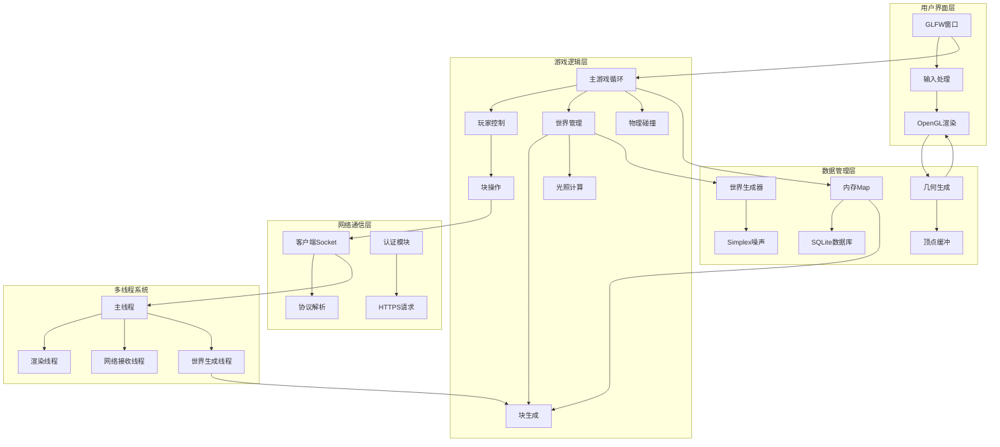
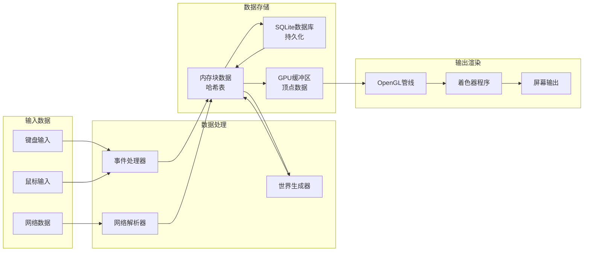
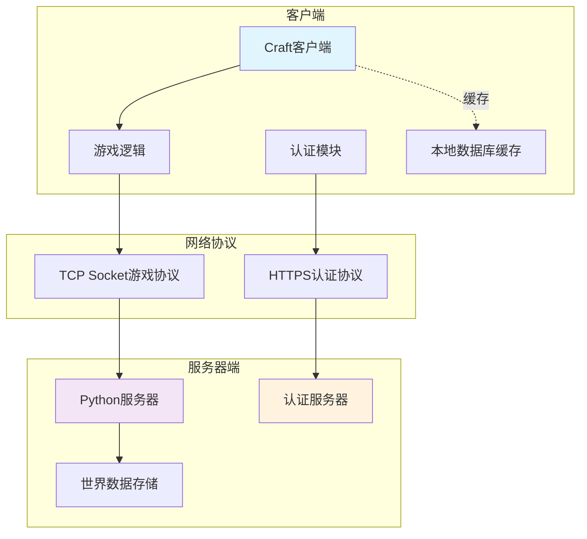

# Craft 项目技术架构分析报告

## 项目简介

Craft 是一个用 C 语言开发的类 Minecraft 体素游戏，支持单机和多人在线模式。项目使用现代 OpenGL 进行 3D 渲染，具备完整的世界生成、块操作、多人协作等功能。

## 技术栈

### 核心技术
- **语言**：C (C99 标准)
- **构建系统**：CMake
- **图形渲染**：OpenGL 3.0+ (现代管线，使用着色器)
- **窗口管理**：GLFW 3.x
- **OpenGL 扩展**：GLEW
- **数据库**：SQLite3
- **网络通信**：libcurl (HTTPS认证) + BSD Sockets (游戏数据)
- **图像处理**：LodePNG
- **多线程**：tinycthread (跨平台)
- **噪声生成**：Simplex Noise

## 主要模块分析

### 1. 核心引擎模块 (`main.c`)
- **主游戏循环**：帧率控制、事件处理、渲染管线
- **状态管理**：玩家状态、世界状态、UI状态
- **输入处理**：键鼠事件、玩家控制
- **渲染协调**：3D场景、HUD、文本渲染

### 2. 世界生成模块 (`world.c`)
- **地形生成**：基于 Simplex 噪声的程序化地形
- **生物群落**：草地、沙地、水域的生成规则
- **植被系统**：草、花、树木的自然分布
- **云层生成**：3D 云朵效果

### 3. 网络通信模块 (`client.c`)
- **协议实现**：基于文本的自定义协议
- **实时同步**：玩家位置、块变更、聊天消息
- **异步通信**：多线程网络接收
- **认证集成**：与认证服务器的 HTTPS 通信

### 4. 数据存储模块 (`map.c`, `db.c`)
- **内存存储**：哈希表实现的快速块查找
- **持久化**：SQLite 数据库存储世界变更
- **缓存机制**：本地缓存远程世界数据
- **增量同步**：只传输变更的块数据

### 5. 3D 渲染模块 (`cube.c`, 着色器)
- **几何生成**：立方体、植物、玩家模型
- **面剔除**：只渲染暴露的面
- **环境光遮蔽**：增强视觉效果
- **动态光照**：可放置的光源系统

### 6. 用户系统模块 (`auth.c`, `sign.c`)
- **身份认证**：在线用户登录验证
- **标牌系统**：3D 文本标牌的放置和编辑
- **聊天系统**：实时文本通信

## 核心功能流程

### 1. 程序启动流程
```
初始化 GLFW/OpenGL → 加载纹理和着色器 → 初始化工作线程 → 
选择模式(离线/在线) → 加载数据库 → 网络连接(如果在线) → 进入主循环
```

### 2. 主游戏循环 (60 FPS)
```
处理输入事件 → 更新玩家位置 → 网络数据同步 → 
世界块管理 → 渲染场景 → 交换缓冲区 → 下一帧
```

### 3. 世界块管理流程
```
计算可见块 → 检查缓存 → 从数据库加载 → 
向服务器请求 → 生成几何体 → 更新 GPU 缓冲区
```

### 4. 多人同步流程
```
本地操作 → 更新本地状态 → 发送到服务器 → 
接收其他玩家操作 → 更新世界状态 → 重新渲染
```

## 系统架构图

### 整体架构图


### 数据流架构图


### 多人网络架构图


## 关键技术特性

### 1. 高性能渲染
- **面剔除优化**：只渲染暴露的块面，大幅减少渲染开销
- **视锥剔除**：只渲染相机视野内的块，提升性能
- **VBO批处理**：将多个块合并到单个顶点缓冲区
- **环境光遮蔽**：实现逼真的光影效果

### 2. 无限世界支持
- **分块加载**：32×32块为单位的动态加载
- **LRU缓存**：智能的内存管理策略
- **程序化生成**：基于种子的确定性地形生成
- **增量同步**：只传输变更的数据

### 3. 多线程架构
- **主线程**：游戏逻辑和渲染
- **网络线程**：异步网络通信
- **工作线程**：世界块的生成和计算
- **线程安全**：使用互斥锁保护共享数据

### 4. 灵活的模式支持
- **离线模式**：本地单机游戏
- **在线模式**：多人协作游戏
- **缓存模式**：混合本地缓存和在线同步

## 性能指标

- **渲染距离**：可配置的渲染半径 (默认 10 块半径)
- **帧率目标**：60 FPS (支持垂直同步)
- **最大玩家数**：128 个并发玩家
- **最大块数**：8192 个活跃块
- **工作线程数**：4 个并行生成线程

## 项目优势

### 技术优势
1. **轻量级**：纯 C 实现，资源占用少
2. **跨平台**：支持 Windows、macOS、Linux
3. **模块化**：清晰的模块划分，易于维护
4. **现代化**：使用现代 OpenGL 和着色器

### 功能优势
1. **完整的游戏体验**：建造、探索、多人协作
2. **实时同步**：低延迟的多人交互
3. **可扩展性**：易于添加新的块类型和功能
4. **稳定性**：成熟的架构和错误处理

## 代码质量评估

**代码结构**：★★★★☆
- 清晰的模块划分
- 合理的函数粒度
- 一致的命名规范

**性能优化**：★★★★★
- 多项渲染优化
- 高效的数据结构
- 异步处理机制

**可维护性**：★★★★☆
- 模块化设计
- 配置文件集中管理
- 清晰的接口定义

## 重要文件说明

### 核心文件
- `src/main.c` - 主程序入口和游戏循环
- `src/world.c` - 世界生成逻辑
- `src/client.c` - 网络通信模块
- `src/map.c` - 内存数据结构
- `src/cube.c` - 3D几何生成
- `src/config.h` - 配置参数

### 着色器文件
- `shaders/block_vertex.glsl` - 块顶点着色器
- `shaders/block_fragment.glsl` - 块片段着色器
- `shaders/sky_vertex.glsl` - 天空顶点着色器
- `shaders/text_vertex.glsl` - 文本顶点着色器

### 资源文件
- `textures/texture.png` - 块纹理贴图
- `textures/font.png` - 字体纹理
- `textures/sky.png` - 天空纹理

## 编译和运行

### 依赖安装
```bash
# macOS
brew install cmake

# Ubuntu
sudo apt-get install cmake libglew-dev xorg-dev libcurl4-openssl-dev
sudo apt-get build-dep glfw

# Windows
# 下载安装 CMake 和 MinGW
```

### 编译步骤
```bash
git clone https://github.com/fogleman/Craft.git
cd Craft
cmake .
make
./craft
```

### 服务器运行
```bash
gcc -std=c99 -O3 -fPIC -shared -o world -I src -I deps/noise deps/noise/noise.c src/world.c
python server.py [HOST [PORT]]
```

## 总结

**Craft** 是一个设计优良的类 Minecraft 体素游戏，展现了以下重要特点：

1. **技术先进性**：使用现代 OpenGL、多线程架构和高效的数据结构
2. **架构合理性**：清晰的模块划分和数据流设计
3. **性能优化**：多项渲染和内存优化技术
4. **功能完整性**：支持单机和多人模式，具备完整的游戏体验
5. **代码质量**：结构清晰，易于理解和维护

这个项目是学习 3D 游戏开发、OpenGL 编程和 C 语言系统编程的优秀范例，特别适合理解：
- 3D 渲染管线的实现
- 多线程游戏架构设计
- 网络游戏同步机制
- 大规模 3D 世界的管理策略

项目代码质量高，架构设计合理，是一个值得深入学习的开源游戏引擎项目。

---

*分析日期：2024年12月*  
*分析工具：代码静态分析*  
*项目版本：基于 GitHub 主分支*

